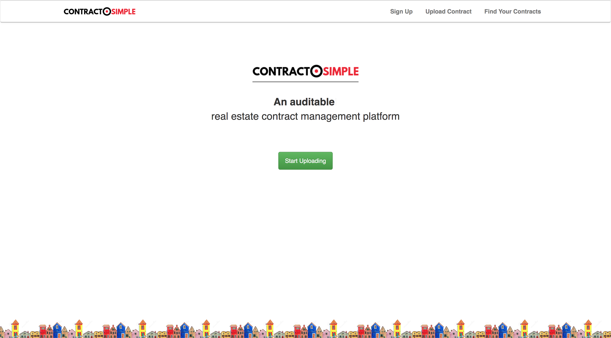
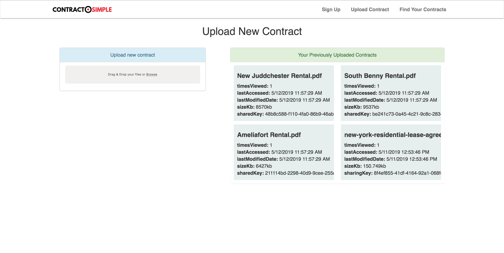

ContractSimple
---

Real Estate contract management platform.

Powered by Quorum.

<b>Check the `README.md` files in each subfolder for more information.</b>

### Concept:

Allow creation of contracts on the platform and record the evolution of them over time. Each Have an existing contract?

Use Quorum to regulate and control access to private documents (BigNYC).

Biggest problems (particularly in NYC):
Traceability - being able to answer questions such as what edits were made to this document. Who had this document?
Manual work - a lot of manual effort is done to parse and track changes to legal documents.

Use truffle for smart contract deployment, and quorum with web3. Hashes are recorded next to each transaction or interaction.

Going after the Coindesk main challenge and the Quorum Privacy subchallenge.

### API
Record new contract based on an uploaded file
<pre>
POST /api/contracts/add
[
    {
        "contractId": XXXX, // uuid of the received contract. (id)
        "locationId": XXXXX, // uuid of the receiving location (id)
        "lat": XXXX, // latitude of the receiver (float)
        "lng": XXX // longitude of the receiver (float)
        "timeMs": XXXXX // time of contract (time ms)
    },
    ...
]
</pre>

Get the history of an contract
<pre>
GET /api/contract/history
{
    "address": XXXX // address of the desired contract.
}
</pre>

Return all contracts
<pre>
GET /api/contracts
</pre>

### Structure

<ul>
    <li><b>/server</b>: Truffle Migrations and Server code managing and interacting with contracts.</li>
    <li><b>/web</b>: Client side reactjs website</li>
    <li><b>/screenshots</b>: Screenshots of app</b></li>  
</ul>

### Screenshots

    <h3>ContractSimple Home Page</h3>
        
    <h3>Uploading a Contract</h3>
        
    <h3>Sharing a Contract</h3>
        
    <h3>Signing a Contract</h3>
        

### TODO:

### Dev Notes
<b>Check the `README.md` files in each subproject for how to start services.</b>

### Useful links
* https://truffleframework.com/tutorials/building-dapps-for-quorum-private-enterprise-blockchains

### Demo Flow
* ContractSimple: Smart Contracts for Contracts. Ever see "this contract must be kept confidential" on a document. Problem is - that contract has probably been viewed/edited by many others before.
* This is a Real Estate tenant contract (show picture of contract). Problem is most contracts need to be kept internal/private.
* Fits into existing workflows - upload any existing contract. (simply upload the contract)
* Grant controlled access to that contract. Grant and *revoke* access. (stored as a smart contract). Only viewable with rovocable key.
* The documents and metadata can be resiliently stored bia distributed p2p storage .
* Record when people make changes, view documents, and sign!
* Can see other contracts / pending proposals, anonymously - or not at all.
